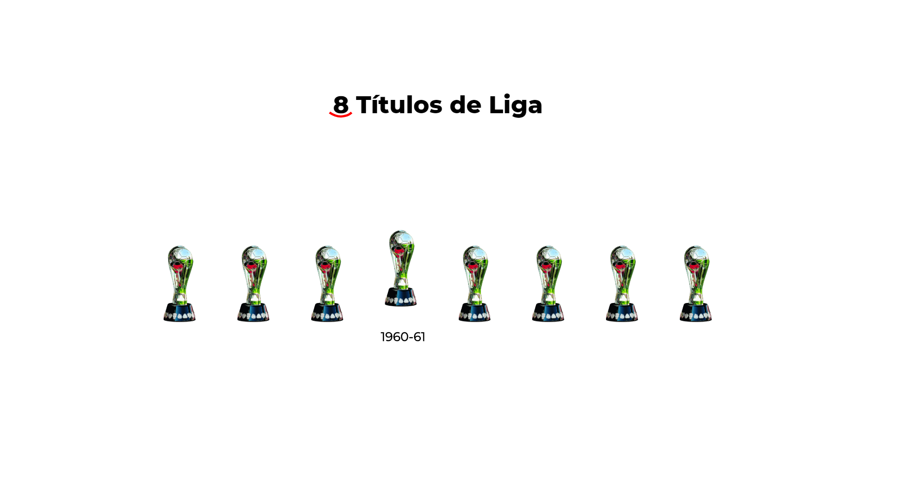

# CAMPEONISIMO
Fue el nombre que se le dio al equipo que representó a Chivas en la etapa comprendida entre 1957 y 1970, esta pagina web es un recordatorio de todos los trofeos que se ganaron en ese año.

## Screenshot


## Getting Started

These instructions will get you a copy of the project up and running on your local machine for development and testing purposes.

### Prerequisites

What things you need to install the software and how to install them

- npm

```
npm install npm@latest -g
```

### Installing

1. Clone the repo

```
git clone https://github.com/UrielMendozaG/campeonisimo.git
```

2. Run npm install inside project root

```
npm install
```

3. Explore

```
Enjoy :)
```


## Contributors

* **Uriel Mendoza** - *Initial work* -

## License

This project is licensed under the MIT License - see the [LICENSE.md](LICENSE.md) file for details

## Acknowledgments

* [Anime.js](https://animejs.com/) - Animacion de los trofeos e interactividad
* [FullPage.js](https://alvarotrigo.com/fullPage/es/) - Efecto de desplazamiento entre paginas
* [Chivas](https://www.chivasdecorazon.com.mx/) - Datos extraidos de la web oficial de Chivas


